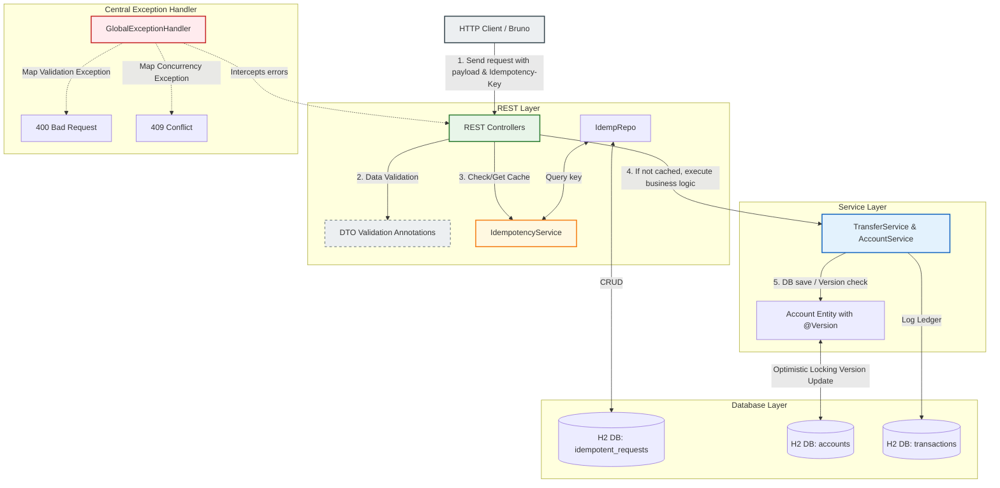
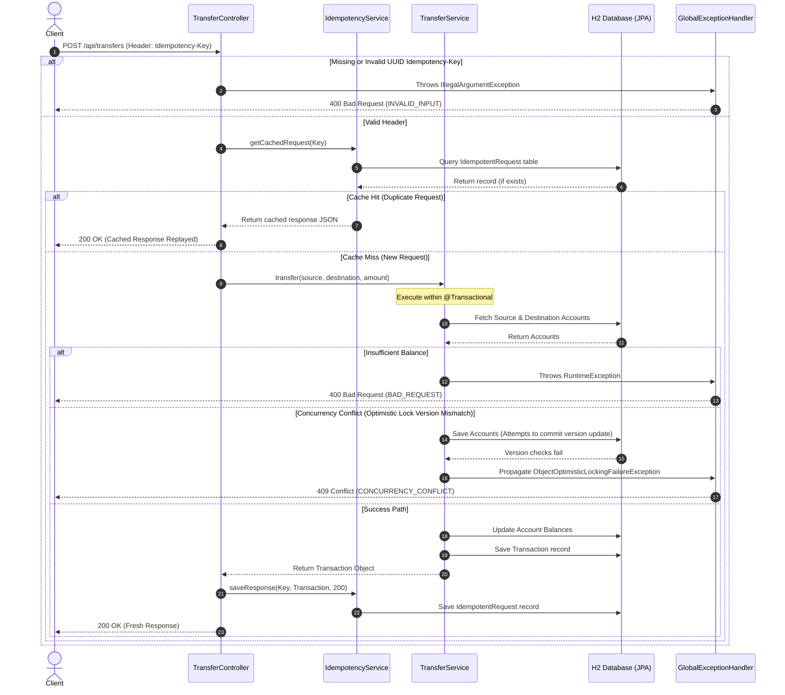

# Banking Monolith Service

This is the monolith implementation of our simple banking application built using **Java Spring Boot 4.x / Jakarta EE** and **H2 In-Memory Database**. It handles account creation, balance lookups, money transfers, and transaction ledgers.

It incorporates enterprise-grade patterns like **Bean Validation (Data Defense)**, **Optimistic Locking (Concurrency Control)**, and **API Idempotency (Request Caching)**.

---

## 🏛️ Architecture & Request Flow

We implemented a classic **3-Tier Layered Architecture** with strict separation of technical concerns. Here is how data and requests flow through the application:



### 🔁 Request Flow Sequence Diagram



### Flow Explanation:
1.  **Request Input & Validation:** The client issues a POST transfer request. The request is intercepted by the controller, which validates constraints (e.g. positive amounts, non-blank accounts). If validation fails, `GlobalExceptionHandler` intercept it and return `400 Bad Request`.
2.  **Idempotency Check:** The controller checks if the `Idempotency-Key` header exists. It queries `IdempotencyService` to check if this key was already processed. If it exists in H2, the cached JSON response is replayed immediately.
3.  **Core Business Processing:** If it's a new request, `TransferService` processes it inside a `@Transactional` block.
4.  **Concurrency Defense:** When updating account balances, Hibernate checks the `@Version` field of the `Account` entity. If another thread updated the account concurrently, an optimistic locking exception is thrown, rolled back, and returned to the client as a `409 Conflict`.
5.  **Response Caching:** On success, the response JSON and HTTP status are cached in H2 via `IdempotencyService` before returning `200 OK` to the client.

---

## 📁 Project Structure & File Guide

Below is a detailed guide of what each folder and file does:

```text
banking-monolith/
├── src/
│   ├── main/
│   │   └── java/com/example/banking_monolith/
│   │       ├── controller/             # REST API Controllers (Web Layer)
│   │       ├── dto/                    # Data Transfer Objects (Request/Response contracts)
│   │       ├── exception/              # Central exception mappings
│   │       ├── model/                  # JPA Database Entities
│   │       ├── repository/             # Spring Data JPA repositories (Database Access)
│   │       ├── service/                # Core Business Logic Services
│   │       └── BankingMonolithApplication.java # Spring Boot main entrypoint
│   └── test/
│       └── java/com/example/banking_monolith/
│           ├── controller/             # Web/API Integration tests
│           └── service/                # Business logic unit & concurrency tests
```

### Detailed File List:

#### 1. Controllers (`/controller`)
*   [`AccountController.java`](file:///Users/vothanhthong/Documents/learn/microservice/banking-monolith/src/main/java/com/example/banking_monolith/controller/AccountController.java): Exposes REST APIs for creating accounts (`POST /api/accounts`) and retrieving details (`GET /api/accounts/{accountNumber}`). Incorporates bean validation checks.
*   [`TransferController.java`](file:///Users/vothanhthong/Documents/learn/microservice/banking-monolith/src/main/java/com/example/banking_monolith/controller/TransferController.java): Exposes REST APIs for transferring money (`POST /api/transfers`) and retrieving transaction history. Enforces the mandatory `Idempotency-Key` HTTP header and controls request caching.

#### 2. Data Transfer Objects (`/dto`)
*   [`AccountRequestDTO.java`](file:///Users/vothanhthong/Documents/learn/microservice/banking-monolith/src/main/java/com/example/banking_monolith/dto/AccountRequestDTO.java): Java record class holding validation constraints for account creation (owner name cannot be blank; initial balance cannot be negative).
*   [`TransferRequestDTO.java`](file:///Users/vothanhthong/Documents/learn/microservice/banking-monolith/src/main/java/com/example/banking_monolith/dto/TransferRequestDTO.java): Java record class holding validation constraints for transfers (source/destination accounts cannot be blank; amount must be positive).

#### 3. Exception Handling (`/exception`)
*   [`GlobalExceptionHandler.java`](file:///Users/vothanhthong/Documents/learn/microservice/banking-monolith/src/main/java/com/example/banking_monolith/exception/GlobalExceptionHandler.java): A global controller advice that handles application runtime exceptions, validation constraints, and optimistic locking failures, turning them into standard JSON error response bodies.

#### 4. Domain Models (`/model`)
*   [`Account.java`](file:///Users/vothanhthong/Documents/learn/microservice/banking-monolith/src/main/java/com/example/banking_monolith/model/Account.java): Database-mapped JPA entity containing account number, owner name, balance, and a `@Version` field to enable JPA optimistic locking.
*   [`Transaction.java`](file:///Users/vothanhthong/Documents/learn/microservice/banking-monolith/src/main/java/com/example/banking_monolith/model/Transaction.java): Database-mapped JPA entity acting as a ledger logging all completed funds transfer records.
*   [`IdempotentRequest.java`](file:///Users/vothanhthong/Documents/learn/microservice/banking-monolith/src/main/java/com/example/banking_monolith/model/IdempotentRequest.java): Database-mapped JPA entity caching the request key (`UUID`), response body string, HTTP status code, and timestamp for idempotency replaying.

#### 5. Repositories (`/repository`)
*   [`AccountRepository.java`](file:///Users/vothanhthong/Documents/learn/microservice/banking-monolith/src/main/java/com/example/banking_monolith/repository/AccountRepository.java): interface providing CRUD operations on the `accounts` table, including custom lookup by account number.
*   [`TransactionRepository.java`](file:///Users/vothanhthong/Documents/learn/microservice/banking-monolith/src/main/java/com/example/banking_monolith/repository/TransactionRepository.java): interface providing queries on the `transactions` table (e.g. search by source/destination account number).
*   [`IdempotentRequestRepository.java`](file:///Users/vothanhthong/Documents/learn/microservice/banking-monolith/src/main/java/com/example/banking_monolith/repository/IdempotentRequestRepository.java): interface managing CRUD checks for unique idempotency key UUIDs.

#### 6. Services (`/service`)
*   [`AccountService.java`](file:///Users/vothanhthong/Documents/learn/microservice/banking-monolith/src/main/java/com/example/banking_monolith/service/AccountService.java): Handles business flow for account database creation and account number generation.
*   [`TransferService.java`](file:///Users/vothanhthong/Documents/learn/microservice/banking-monolith/src/main/java/com/example/banking_monolith/service/TransferService.java): Orchestrates atomic funds transfer rules under a `@Transactional` block. Updates source/destination balances and logs a transaction ledger record.
*   [`IdempotencyService.java`](file:///Users/vothanhthong/Documents/learn/microservice/banking-monolith/src/main/java/com/example/banking_monolith/service/IdempotencyService.java): Coordinates API request logging. Serializes output objects to JSON and deserializes them back for response replay, compatible with Jackson 3.

---

## 🧪 Test Suite Guide

We wrote unit and integration tests to verify correctness:
*   [`BankingMonolithApplicationTests.java`](file:///Users/vothanhthong/Documents/learn/microservice/banking-monolith/src/test/java/com/example/banking_monolith/BankingMonolithApplicationTests.java): Sanity test checking if the Spring ApplicationContext loads without errors.
*   [`TransferServiceTest.java`](file:///Users/vothanhthong/Documents/learn/microservice/banking-monolith/src/test/java/com/example/banking_monolith/service/TransferServiceTest.java): Mockito-based unit test verifying business rules (e.g., successful balance updates, insufficient balance exception).
*   [`OptimisticLockingIntegrationTest.java`](file:///Users/vothanhthong/Documents/learn/microservice/banking-monolith/src/test/java/com/example/banking_monolith/service/OptimisticLockingIntegrationTest.java): Integration test that runs concurrent threads executing transfers from the same account, checking that optimistic locking successfully blocks race conditions and one transfer fails with `ObjectOptimisticLockingFailureException`.
*   [`IdempotencyIntegrationTest.java`](file:///Users/vothanhthong/Documents/learn/microservice/banking-monolith/src/test/java/com/example/banking_monolith/controller/IdempotencyIntegrationTest.java): Controller integration test using `MockMvc` to verify validation of the `Idempotency-Key` header and correct response caching/replaying.

---

## 🔌 API Endpoints

### Accounts API
*   **Create Account:**
    *   Method: `POST /api/accounts`
    *   Headers: None
    *   Request Body: `{"ownerName": "Alice", "initialBalance": 100.00}`
    *   Status: `201 Created`
*   **Get Account Details:**
    *   Method: `GET /api/accounts/{accountNumber}`
    *   Status: `200 OK`

### Transfers API
*   **Transfer Funds:**
    *   Method: `POST /api/transfers`
    *   Headers: `Idempotency-Key: <UUID>` (Mandatory)
    *   Request Body: `{"sourceAccountNumber": "ACC-1", "destinationAccountNumber": "ACC-2", "amount": 30.00}`
    *   Status: `200 OK` (Replays cached response on duplicate UUID)
*   **Get Transaction History:**
    *   Method: `GET /api/transfers/history/{accountNumber}`
    *   Status: `200 OK`

---

## 🛠 H2 Database Console

Our database runs completely in memory. To view SQL tables in your browser:
1. Start the app.
2. Go to: **`http://localhost:8080/h2-console`**
3. Input the following credentials:
   *   **JDBC URL:** `jdbc:h2:mem:bankingdb`
   *   **User Name:** `sa`
   *   **Password:** `password`

---

## 🚦 How to Run & Test
1. Compile and compile the application:
   ```bash
   ./mvnw clean compile
   ```
2. Run all tests:
   ```bash
   ./mvnw test
   ```
3. Start the application:
   ```bash
   ./mvnw spring-boot:run
   ```
4. To test the API endpoints, follow the instructions in the [Bruno API collection guide](../bruno/README.md).
