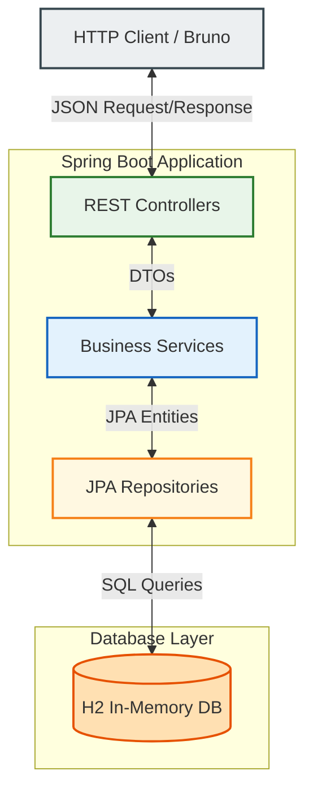

# Banking Monolith Service

This is the monolith implementation of our simple banking application built using **Java Spring Boot 3.x / 4.x** and **H2 In-Memory Database**. It handles account creation, balance lookups, money transfers, and transaction ledgers.

---

## 🏛️ Architecture Diagram

We implemented a classic **3-Tier Layered Architecture** with strict separation of technical concerns. Here is how data and requests flow through the application:



### Flow Explanation:
1.  **Controller Layer:** Receives incoming JSON payloads from Bruno/curl. It maps HTTP requests to Java classes and handles REST responses.
2.  **Service Layer:** Executes core banking business rules (e.g. validating sufficient funds, ensuring transfer amounts are positive, handling `@Transactional` boundaries).
3.  **Repository Layer:** Handles database queries. It uses Spring Data JPA to interact with H2 in memory, completely abstracting SQL queries from our Java code.

---

## 📁 Package Structure

The project follows the **Package-by-Layer** pattern under `com.example.banking_monolith`:

```text
com.example.banking_monolith/
│
├── controller/        # REST APIs (AccountController, TransferController)
├── dto/               # Immutable DTO Data carriers (Java Records)
├── exception/         # REST Exception mapping (@RestControllerAdvice)
├── model/             # JPA Entities / Database models (Account, Transaction)
├── repository/        # JPA Database Repositories (interfaces)
└── service/           # Business Logic (AccountService, TransferService)
```

---

## 🔌 API Endpoints

### Accounts API
*   **Create Account:**
    *   Method: `POST /api/accounts`
    *   Request Body: `{"ownerName": "Alice", "initialBalance": 100.00}`
    *   Status: `201 Created`
*   **Get Account Details:**
    *   Method: `GET /api/accounts/{accountNumber}`
    *   Status: `200 OK`

### Transfers API
*   **Transfer Funds:**
    *   Method: `POST /api/transfers`
    *   Request Body: `{"sourceAccountNumber": "ACC-1", "destinationAccountNumber": "ACC-2", "amount": 30.00}`
    *   Status: `200 OK`
*   **Get Transaction History:**
    *   Method: `GET /api/transfers/history/{accountNumber}`
    *   Status: `200 OK`

---

## 🛠️ H2 Database Access

Our database runs completely in memory. To view SQL tables in your browser:
1. Start the app.
2. Go to: **`http://localhost:8080/h2-console`**
3. Input the following credentials:
   *   **JDBC URL:** `jdbc:h2:mem:bankingdb`
   *   **User Name:** `sa`
   *   **Password:** `password`

---

## 🚦 How to Run & Test
1. Compile and compile the application:
   ```bash
   ./mvnw clean compile
   ```
2. Start the application:
   ```bash
   ./mvnw spring-boot:run
   ```
3. To test the API endpoints, follow the instructions in the [Bruno API collection guide](../bruno/README.md).
